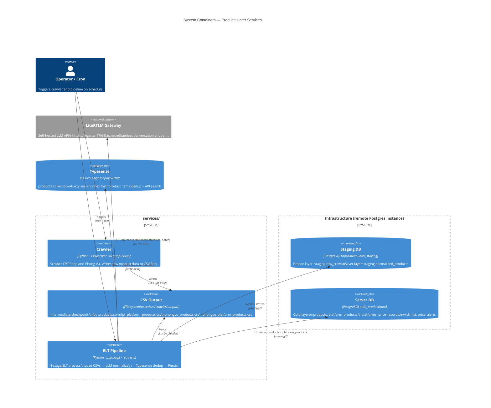
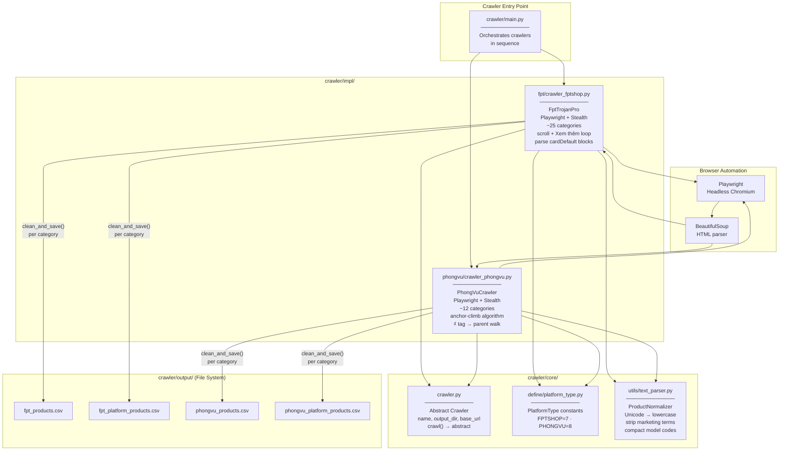
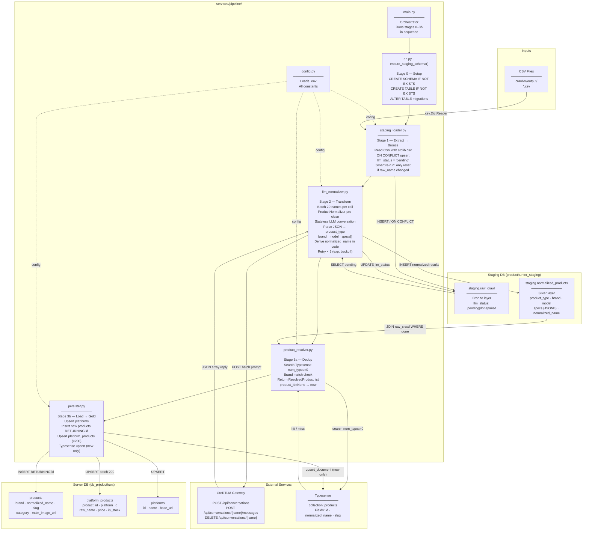
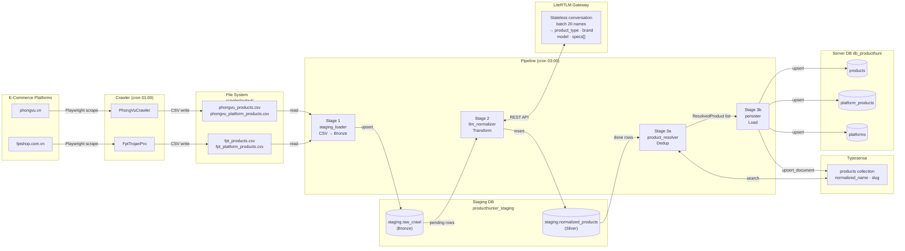

# Technical Architecture: Crawler & ELT Pipeline

## Overview

The `services/` layer has two independent subsystems:

1. **Crawler** — scrapes product listings from e-commerce platforms, outputs raw CSV files.
2. **Pipeline** — reads those CSVs, normalises product names via an LLM, and loads clean data into the production database and search index.

They are deliberately decoupled: the crawler has **no database or Typesense knowledge**. All storage logic lives exclusively in the pipeline.

---

## System Container Diagram

High-level view of every runtime component and how they communicate.



---

## Directory Structure

```
services/
├── .env                          # Shared config (both crawler + pipeline)
├── .env.example                  # Template with all required keys
├── crawler/
│   ├── main.py                   # Crawler entry point
│   ├── run_crawler.sh            # Shell wrapper (for cron)
│   ├── core/
│   │   ├── crawler.py            # Abstract base class (scrape-only)
│   │   ├── define/
│   │   │   └── platform_type.py  # Platform ID constants
│   │   └── storage/              # Reusable storage clients (used by pipeline)
│   │       ├── database_handler.py
│   │       ├── storage_manager.py
│   │       ├── typesense_handler.py
│   │       └── models/
│   │           ├── product.py
│   │           └── platform_product.py
│   ├── impl/
│   │   ├── fpt/crawler_fptshop.py     # FPT Shop scraper
│   │   └── phongvu/crawler_phongvu.py # Phong Vũ scraper
│   ├── utils/
│   │   └── text_parser.py        # ProductNormalizer (pre-cleaning utility)
│   └── output/                   # CSV snapshots written after each crawl
│       ├── fpt_products.csv
│       ├── fpt_platform_products.csv
│       ├── phongvu_products.csv
│       └── phongvu_platform_products.csv
└── pipeline/
    ├── main.py                   # Pipeline entry point (orchestrator)
    ├── run_pipeline.sh           # Shell wrapper (for cron)
    ├── config.py                 # All config/env constants
    ├── db.py                     # Postgres connection helpers + staging schema DDL
    ├── staging_loader.py         # Stage 1: CSV → staging.raw_crawl
    ├── llm_normalizer.py         # Stage 2: LLM normalization → staging.normalized_products
    ├── product_resolver.py       # Stage 3a: Typesense dedup → resolve product_id
    └── persister.py              # Stage 3b: Upsert server DB + Typesense sync
```

---

## Crawler Subsystem

### Crawler Component Diagram

Internal structure of the crawler subsystem and data flow out to CSV files.



### Responsibility
Pure data extraction. Each crawler scrapes one platform and writes two CSV files to `crawler/output/`. No database writes, no Typesense calls.

### Base Class: `core/crawler.py`
```python
class Crawler(ABC):
    def __init__(self, name, output_dir, base_url): ...
    def crawl(self) -> None: ...   # abstract
```

### Concrete Crawlers

| Crawler | Platform | Platform ID | Tech |
|---|---|---|---|
| `FptTrojanPro` | FPT Shop | 7 | Playwright + BeautifulSoup + Stealth |
| `PhongVuCrawler` | Phong Vũ | 8 | Playwright + BeautifulSoup + Stealth |

### Crawl Flow (per crawler)
```
For each category URL:
  1. Launch Playwright (headless Chrome + stealth)
  2. Dismiss popups, scroll, click "Xem thêm" until page is fully loaded
  3. Parse HTML with BeautifulSoup → extract (product, platform_product) pairs
  4. Append to in-memory lists
  5. Call clean_and_save() → write/overwrite CSV (incremental, crash-safe)
```

### CSV Output Schema

**`*_products.csv`** (normalised product identity)
| Column | Type | Description |
|---|---|---|
| `normalized_name` | str | Pre-cleaned name (lowercase, no accents, no junk) |
| `slug` | str | URL-safe identifier (unique per product) |
| `brand` | str | Extracted brand name |
| `category` | str | Platform category slug |
| `main_image_url` | str | Product image URL |

**`*_platform_products.csv`** (platform-specific listing)
| Column | Type | Description |
|---|---|---|
| `product_id` | UUID | Left empty at crawl time — filled by pipeline |
| `platform_id` | int | Platform constant (7=FPT, 8=PhongVu) |
| `raw_name` | str | Original title from the platform page |
| `original_item_id` | str | Platform's own slug/ID for the listing |
| `url` | str | Full product page URL |
| `affiliate_url` | str | Affiliate link (if configured) |
| `current_price` | Decimal | Current selling price (VND) |
| `original_price` | Decimal | Original/list price (VND) |
| `in_stock` | bool | Availability |
| `last_crawled_at` | ISO 8601 | Timestamp of this crawl run |

### Text Pre-cleaning: `utils/text_parser.ProductNormalizer`
Applied by crawlers during HTML parsing and reused by the pipeline LLM stage as a pre-cleaning pass:
- Unicode NFKC normalisation → lowercase
- Remove bracketed content `[...]`, `(...)`, `【...】`
- Strip Vietnamese marketing keywords (`chính hãng`, `freeship`, `trả góp`, …)
- Remove special characters, compact model codes (`wh 1000 xm5` → `wh1000xm5`)

### Running the Crawler
```bash
# From repo root:
python -m services.crawler.main

# Or via shell wrapper (used by cron):
/bin/bash services/crawler/run_crawler.sh
```

---

## Pipeline Subsystem (ELT)

### Pipeline Component Diagram

The 4-stage ELT process, the modules that own each stage, and the data stores they interact with.



### Responsibility
Reads crawler CSVs → normalises product names using an LLM → loads clean data into the production server DB and Typesense search index.

### Databases

| Database | Purpose | Config key |
|---|---|---|
| `producthunter_staging` | Bronze + Silver staging layers | `STAGING_DB_URL` |
| `db_producthunt` | Production server DB (Gold) | `SERVER_DB_URL` |

Both are on the same Postgres instance; the pipeline opens two separate connections.

### Staging Schema (auto-created on first run)

```sql
-- Bronze layer: raw crawled data, one row per platform listing
staging.raw_crawl (
    id               UUID PK,
    source_file      TEXT,           -- e.g. 'fpt_platform_products.csv'
    platform_id      INT,
    raw_name         TEXT,           -- original title from platform
    original_item_id TEXT,
    url, affiliate_url, current_price, original_price, in_stock,
    main_image_url, last_crawled_at,
    ingested_at      TIMESTAMPTZ,
    llm_status       TEXT            -- 'pending' | 'done' | 'failed'
    UNIQUE (platform_id, original_item_id)
)

-- Silver layer: LLM normalisation results
staging.normalized_products (
    raw_id           UUID FK → staging.raw_crawl(id),
    normalized_name  TEXT,           -- derived: "<brand> <model> <specs...>"
    brand            TEXT,
    product_type     TEXT,           -- e.g. 'smartphone', 'laptop'
    model            TEXT,           -- e.g. 'Poco M7 Pro 5G'
    specs            JSONB,          -- [{name, value}, ...]
    category         TEXT,           -- alias of product_type
    llm_model        TEXT,
    normalized_at    TIMESTAMPTZ
)
```

### Pipeline Stages

#### Stage 1 — `staging_loader.py` (Extract → Bronze)
- Reads CSVs with stdlib `csv` (no pandas dependency)
- Upserts into `staging.raw_crawl` via `ON CONFLICT (platform_id, original_item_id)`
- Smart re-run logic: only resets `llm_status = 'pending'` when `raw_name` changed (product was renamed on platform). Price-only updates keep `llm_status = 'done'`.

#### Stage 2 — `llm_normalizer.py` (Transform via LiteRTLM)
- Queries `WHERE llm_status = 'pending'` in batches of `LLM_BATCH_SIZE` (default 20)
- Pre-cleans each `raw_name` with `ProductNormalizer` before sending to reduce LLM prompt noise
- Creates a **stateless conversation** on LiteRTLM per batch → sends one blocking message → deletes conversation
- LLM prompt returns structured JSON per product: `{ product_type, brand, model, specs: [{name, value}] }`
- `normalized_name` is **derived in code** from `brand + model + spec values` (not from LLM) — deterministic dedup key
- On network error: retries up to `LLM_MAX_RETRIES` (default 3) with exponential backoff (2s, 4s, 8s)
- On JSON parse failure: marks rows `'failed'`, continues — they will be retried on the next pipeline run
- Writes results to `staging.normalized_products`, marks `llm_status = 'done'`

#### Stage 3a — `product_resolver.py` (Dedup via Typesense)
- Joins `staging.raw_crawl` + `staging.normalized_products WHERE llm_status = 'done'`
- For each row: searches Typesense with `num_typos=0` (strict — avoids false merges across brands)
- If top hit's brand matches → reuse existing `product_id` (`is_new=False`)
- Otherwise → mark as new (`product_id=None`, `is_new=True`)
- Returns `List[ResolvedProduct]` dataclass

#### Stage 3b — `persister.py` (Load → Gold)
1. **Upsert platforms** — inserts/updates `platforms` table from `PLATFORM_META` dict
2. **Insert new products** — `INSERT INTO products ... ON CONFLICT (slug) DO UPDATE ... RETURNING id, slug` to retrieve generated UUIDs
3. **Upsert platform_products** — batch of 200 rows, `ON CONFLICT (platform_id, original_item_id) DO UPDATE`
4. **Typesense sync** — only new products are indexed (avoids redundant upserts for existing products)

### LiteRTLM Integration

Uses the `/api/conversations` REST API (stateless mode):

```
POST /api/conversations        { name: "pipeline-norm-<uuid>", stateless: true }
POST /api/conversations/{name}/messages  { message: "<prompt>" }
→ { reply: "[{...}, ...]" }
DELETE /api/conversations/{name}
```

Auth: `Authorization: Bearer <LITELLM_API_KEY>` (preferred) or JWT login fallback.

### Running the Pipeline
```bash
# From repo root:
python -m services.pipeline.main

# Or via shell wrapper (used by cron):
/bin/bash services/pipeline/run_pipeline.sh
```

### Cron Schedule (recommended)
```cron
0 1 * * *  /bin/bash /path/to/services/crawler/run_crawler.sh   >> .../output/cron.log 2>&1
0 3 * * *  /bin/bash /path/to/services/pipeline/run_pipeline.sh >> .../pipeline/logs/pipeline.log 2>&1
```
2-hour gap ensures the crawler finishes before the pipeline starts.

---

## Configuration Reference (`services/.env`)

| Key | Used by | Description |
|---|---|---|
| `POSTGRES_HOST/PORT/USER/PASSWORD/DB` | Crawler (legacy), Pipeline fallback | Postgres connection parts |
| `SERVER_DB_URL` | Pipeline | Full DSN for production server DB |
| `STAGING_DB_URL` | Pipeline | Full DSN for staging DB |
| `TYPESENSE_HOST/PORT/API_KEY/PROTOCOL` | Pipeline | Typesense connection |
| `LITELLM_BASE_URL` | Pipeline | LiteRTLM gateway base URL |
| `LITELLM_API_KEY` | Pipeline | API key for LiteRTLM (preferred auth) |
| `LITELLM_USERNAME/PASSWORD` | Pipeline | JWT login fallback (if no API key) |
| `LLM_BATCH_SIZE` | Pipeline | Names per LLM call (default: 20) |
| `LLM_MAX_RETRIES` | Pipeline | LLM call retry limit (default: 3) |

---

## Idempotency Guarantees

| Operation | Behaviour on re-run |
|---|---|
| Stage 1 CSV load | `ON CONFLICT` upsert — no duplicates; only resets `llm_status` if `raw_name` changed |
| Stage 2 LLM normalize | Only processes `llm_status = 'pending'` rows — already-normalized rows are skipped |
| Stage 3 product insert | `ON CONFLICT (slug) DO UPDATE` — safe to re-run |
| Stage 3 platform_products | `ON CONFLICT (platform_id, original_item_id) DO UPDATE` — safe to re-run |
| Typesense sync | `upsert_document` — idempotent |

---

## End-to-End Data Flow


